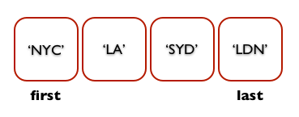

#BEWD
##Collections & Loops

---


##Agenda

* Revision
* Iteration - Loops
* Collections
  * Arrays
  * Hashes

---


##Statements

* <code>puts 'Hello World!'</code>
* <code>input_string = gets</code>


---

##Expressions

* Examples
  * <code>2 + 3</code>
  * <code>6 - 3</code>
  * <code>4.5 * 3.5</code>
  * <code>6 / 3</code>

---

##Assignment (Variables)

* A variable has a name and a value
  * <code>x = 2</code>
  * <code>y = 3</code>
  * <code>z = x * y</code>
* Variables can be used in statements
  * <code>puts x + ' * ' + y + ' equals ' + z</code>

---


##Conditional Statements

* Expression evaluates to <code>true</code> or <code>false</code>
<pre><code>
x = 2
y = 3
if x &lt; y
&nbsp;puts 'x is less than y'
else
&nbsp;puts 'x is greater than or equal to y'
end
</code></pre>

---

##Methods

* A code block that contains a series of statements
* Methods are used to create re-usable code blocks
  * Example(s)
* Method names need to be unique
* Can take multiple parameters
* Returns a single value

---

##Method Example

* How to define a function
<pre><code>
def multiply(x, y)
  return x * y
end
</code></pre>

* How to invoke a function
<pre><code>
z = multiply(2, 3)
</code></pre>

---

##Iteration
###Repetition
###Repetition
###Repetition


---


##Iteration (Ruby-esque Loops)

* Times Iterator
<pre><code>
3.times do
&nbsp;puts "going…"
end
puts "gone"
</code></pre>
* Example output
<pre><code>
going...
going...
going...
gone
</code></pre>

---

##Iteration (Ruby-esque Loops)


* .upto iterator
<pre><code>
  1.upto(3) do |num|
    puts "#{num}.going"
  end
</code></pre>
* Example output
<pre><code>
going
going
going
</code></pre>

---


##Iteration (Ruby-esque Loops)

* .downto iterator
<pre><code>
3.downto(1) do |guess|
&nbsp;puts "#{guess} guesses left"
end
</code></pre>
* Example output
<pre><code>
3 guesses left
2 guesses left
1 guesses left
</code></pre>

---


##Iteration (Ruby-esque Loops)
###Less common in Ruby

* These loops are less common in Ruby, but good to know as a programmer.

  * X.times
  * upto
  * downto

* For additional help with syntax, see the Resources at the end of the slides.

---


##Conditional Loops

<pre><code>
count = 10
while count &gt; 0
&nbsp;puts "Looping"
&nbsp;count -=1
end
</code></pre>
<pre><code>
count = 10
until count &lt; 1
&nbsp;puts "Looping"
&nbsp;count -= 1
end
</code></pre>
<pre><code>
count = 10
loop do
&nbsp;break if count < 1
&nbsp;puts "Looping"
&nbsp;count -= 1
end
</code></pre>

---


##Loop

---


##Iteration Recap
###Recap

* Iteration in programming allows us to keep our code DRY
* Loops are used to repeat lines of code
* Common or Ruby-esque loops are

  * .times
  * .upto
  * .downto
  * .each (we will see in a moment)

---


##Collections
###Working with Collections in Ruby

---


##Collections
###Arrays


---


##Arrays
###Find by Index


---


##Arrays
###Find by Index

<pre><code>
my_array = ["NYC", "LA", "SYD", "LDN"]
my_array[0] #"NYC"
my_array[1] #"LA"
my_array[-1] #"LDN"
</code></pre>

---


##Arrays
###Find by Position



---


##Arrays
###Find by Position

<pre><code>
my_array = ["NYC", "LA", "SYD", "LDN"]
my_array.first #"NYC"
my_array.last #"LDN"
</code></pre>

<pre><code>
# In rails...
# Will not work in IRB
my_array = ["NYC", "LA", "SYD", "LDN"]
my_array.second
my_array.third
my_array.forth
my_array.fifth
my_array.forty_two # known as the reddit
</code></pre>

---

##Arrays
###Array Methods

<pre><code>
name = "Salman"
puts name.upcase
</code></pre>

<pre><code>
my_array = ["NYC", "LA", "SYD", "LDN"]
my_array.reverse
</code></pre>

---


##Arrays

to irb!


---


##Arrays

---


##Arrays
###Recap


* A collection of data
* Can search an array by index or position
* Arrays are objects and therefore have methods.

---


##Collections
###Hashes


* Often referred to as dictionaries
* Each entry in a hash needs a *key* and a *value*
* If you access a hash at a specific key, it will return the value at that key

---


##Hashes
###Find by key

<pre><code>
ga_markets = {"NYC" => "New York City", "LA" => "Los Angeles", "SYD" => "Sydney", "LDN" => "London"}
ga_markets["NYC"]
ga_markets["LA"]
ga_markets["SYD"]
</code></pre>

<pre><code>
"New York City"
"Los Angeles"
"Sydney"
</code></pre>

---

##Hashes
###Setting Values

<pre><code>
user_hash = {}
user_hash["name"] = "Salman"
user_hash["favorite_color"] = "Green"
user_hash

>> {"name"=>"Salman", "favorite_color"=>"Green"}
</code></pre>
---

##Symbols
###New Ruby type

* A symbol is a special type of object in ruby, used extensively
* It is always preceded by a colon
* Cannot contain spaces or numbers
* Symbols are used because:
  * they are immutable and take less memory
  * they are easier to compare to other objects
  * they are cleaner in syntax
* Examples:
  * ```:hello```
  * ```:this_is_a_symbol```

---


##Symbols
###Primarily used as keys for hashes

<pre><code>
ga_markets = {}
ga_markets = {:NYC => "New York City"}
ga_markets[:LA] = "Los Angeles"
ga_markets

>> {:NYC => "New York City", :LA => "Los Angeles"}
</code></pre>

---

##Hash
###Methods

<pre><code>
user = {:user_name => "SalmanAnsari", :email => "salman.ansari@gmail.com"}

user.has_key? :email #true
user.key? :email #true
user.include? :email #true

user.has_value? "SalmanAnsari" #true (note: extremely inefficient!)
</code></pre>

---

##Hash
###Ruby 1.9+ Alternate Syntax

<pre><code>
user = {:user_name => "SalmanAnsari", :email => "salman.ansari@gmail.com"}

# becomes
user = {user: "SalmanAnsari", email: "salman.ansari@gmail.com"}

# a little bit more concise
# more closely matches JSON format
# considered an 'alternate' syntax, not a replacement
</code></pre>

---

##Collections
###Array of Hashes

<pre><code>
users = [
  {:user => "Salman Ansari", :role => "Instructor"},
  {:user => "Brooks Swinnerton", :role=> "TA"}
  {:user => "Brian Fountain", :role => "TA"]
]

# Alternate syntax for Ruby 1.9+

users = [
  {user: "Salman Ansari", role: "Instructor"},
  {user: "Brooks Swinnerton", role: "TA"},
  {user: "Brian Fountain", role: "TA"}
]
</code></pre>

---


##Iterating Over Collections
###.each

<pre><code>
ga_markets = ["NYC", "LA", "SYD", "LDN"]
ga_markets.each {|market| puts market}
</code></pre>

---


##Lab Time
###Teddit Collections

---


##Recap
###Iterating Over Collections


---

## Homework


Continue work on Secret Number. Due next class (lesson 4)

---


## Resources: Collections, Loops and APIs


###Cheat Sheet

####Arrays

__Creating Arrays__

```ruby
my_array = ["Apples", "Oranges", "Pears"]
```

> ["Apples", "Oranges", "Pears"]

```ruby
my_array = Array.new
```

> []

```ruby
Array.new(3)
```

> [nil, nil, nil]

```ruby
Array.new(3, "BEWD")
```

> ["BEWD", "BEWD", "BEWD"]

__Assessing Elements__

```ruby
arr = ["NYC", "LDN", "LA", "SF", "BOS", "BER"]
arr[0]
arr[100]
arr[-3]
```

> NYC

> nil

> SF

```ruby
arr[2, 3] #=> [3, 4, 5]
```

> ["LA", "SF", "BOS"]

```ruby
arr[1..4]
```

> [LDN, LA, SF, BOS]

####Hashes

```ruby
  GA_Markets = { "New York City"=>"NYC", "London"=>"LDN", "Los  Angeles"=>"LA", "San Francisco"=>"SF", "Boston"=>"BOS",   "Berlin"=>"BER" }

  GA_Markets["London"]
```

> "LDN"

```ruby
  super_heros = { batman: "Bruce Wayne", superman: "Clark Kent",  spiderman: "Peter Parker"}

  super_heros[:superman]
```

> "Clark Kent"

####Loops

__Iterator loop__

```ruby
4.times do
  puts "This will be printed 4 times"
end
```

> This will be printed 4 times

> This will be printed 4 times

> This will be printed 4 times

> This will be printed 4 times

__Each Loop__

```ruby
    # A list of GA Courses
    courses = [ "FEWD", "BEWD", "CSF" ]

  names.each do|n|
      puts "GA has a course on #{n}"
  end
```

> GA has a course on FEWD

> GA has a course on BEWD

> GA has a course on CSF


###Tips, Tricks & Motivation

- [The Best Way to Learn Ruby & Rails](http://astonj.com/tech/best-way-to-learn-ruby-rails/)
-  What is iteration - [article](http://www.computerhope.com/jargon/i/iteration.htm)


###Still Feel Lost?
####Catch Up With These Resources

- Teddit Hashes Answer [Video](http://vimeo.com/gatv/review/67752035/a90db9177f) by Steven Nuñez on behalf of General Assembly
  - password=> BEWD_GA

- Arrays [Ruby Docs](http://ruby-doc.org/core-2.0/Array.html)
- Hashes [Ruby Docs](http://ruby-doc.org/core-2.0/Hash.html)
- Hashes and Arrays [Tutorial](http://www.codecademy.com/courses/ruby-beginner-en-F3loB?curriculum_id=5059f8619189a5000201fbcb)
- [*“Ruby-esque”* Loops](http://ruby.about.com/od/rubyfeatures/a/loops_2.htm) see page 1 for more ruby loops not covered in class.


