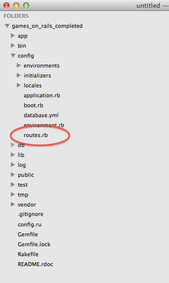
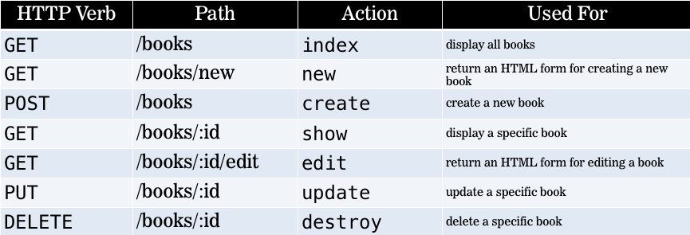
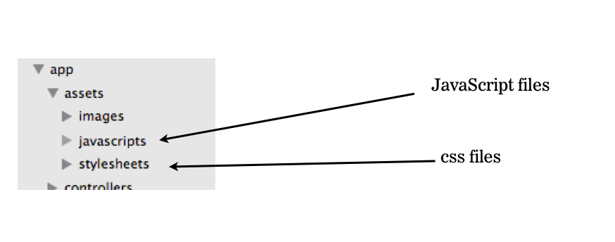

#BEWD - Routes, Controllers & Views

---

##Agenda

Learning Objective: Understand flow of control in a Rails app.

*	Routes
*	Controllers
*	Views
*	Lab Time

---

##Request Response
###Review

---

##Games on Rails

---

##The Router
###routes.rb

*	Located at config/routes.rb
*	Connects URLs to code
	* Used for mapping urls to your code
*	Current Routes: $ rake routes
	*	Rails 4: Can be seen at http://localhost:3000/rails/info/routes

---

##Routes
###http verbs

GET, POST, PUT/PATCH, DELETE

---

##Http Verbs
###When GET is called.

*	Visiting a website
*	Clicking a link

---

##Model View Controller
###aka MVC

---

##MVC
###Routes to Controller

Controllers:

*	Render a View
*	Redirect to another view

---

##Controllers
###Controllers Are Objects!

*	Responsible for parsing user request

*	It can display some text to the browser, redirect to another path or send an error message.

*	Contains actions (aka functions)

---

##Controllers
###Methods

*	Recall: methods are "def blocks" in Ruby classes.
* Controllers are also classes, like any other.
* However, methods inside a controller are not like any other method; they are special (called Controller Actions)
* A Rails action gets invoked when a route matches to that controller/action combination
* Note: a private/protected method in a controller is NOT an action (you cannot hit that method via a URL). You can use private/protected methods to have helper methods inside a controller without being actions.

---

##Controllers
###Params

*	http://localhost:3000/games/secret_number/7
*	7 is a param, based on URL convention in the routes

---

##MVC
###Controller to Views

*	Views can be rendered directly by the controller
	*	Note: Not scalable when HTML file gets more complex

*	By default your controller renders the view named controller_name/action_name.html.erb

---

##Views
###html.erb

*	Can write html
*	Can write pure ruby.

		<% @games.each do |game| %>
			<%= game %>
		<% end %>

		<% 1 + 1 %> // won't show
		<%= 2 + 2 %> // will show!

---

##Views
###application.html.erb

*	All views are wrapped inside application.html.erb
	*	It loads the assets
	*	sets up the meta tags, titles etc...
	*	You can render no layout Or a different layout

---

##Views
###Assets Folder

* Keeps javascript files, stylesheets, and images

---

## Homework

Final project proposal due lesson 9.

---

##Lab Time

Add Rock Paper Scissors to Games on Rails

---

